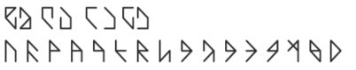
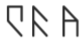
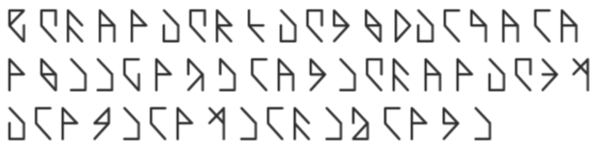
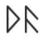

# 通用语言

---

## 概述

理解为世界上的所有的东西由三种基础组成分别是，‘是’，‘否’和‘无’，由于基本不存在生命体能理解‘无’这一基础，所以选择由‘是’和‘否组成的二进制(基于人类理解，实际上就是两个状态，称之为二进制是比较易懂)来编写这一门语言。毕竟对于‘是’和‘否’两种状态，宇宙中所有的生命都能理解。

## 注意!

对于人类而言，看到0或1可以表示两个状态，盲人的话可以是触摸到凸起表示1，凹为0。连续的有规律的敲打某个东西，发出声音为1，不发出声音为0。圆形为1，方形为0。最简单的两个状态就是“是”和“否”。对于人类也可以理解为“有”和“无”，虽然这样不严谨，因为人类理解的无（没有）实际上是一种“否”的表达，但是两个状态是所有生命能理解的最小单位。

*------------------------------------------------------------------------------------------------------*

以下用1或0表示这两个状态，仅仅为了人类好理解，实际上只要用能表示两种状态的任何东西都可以。（再次声明，对于不同的物种可能对于两个状态的理解方式不同，对于同物种对于两个状态的理解也可能有很多方式，但是总的来说，不管怎样，都脱离不了两个状态的实质。所以从本质而言，可能去理解这两个状态的方式不同，但是理解到的内容是一样的。）

### **单词**

6个比特位表示一个音，一个词由x个音组成，第1位或者第6位为1的情况下表示这个音为分隔符（也称分隔音）。第1位和第6位为0对应16中情况，表示16个可用音。

- 分隔音(以下为了好理解用各种括号先代替之)
  - \{\} 大括号对应100000和000001，大括号内表示一个完整的句子
  - \[\] 中括号对应110000和000011，方括号内表示一个独立的词
  - \(\) 小括号对应111000和000111，小括号内词修饰上一个紧挨着的词，小括号内的词可能不止一个。
  - <> 尖括号对应111100和001111，尖括号内表示句子的补充，包括时间地点等。
  
- 可用音(由000000 到 011110 组成的16个单音)

包括分隔音一共是24个音，为了人类好理解，24个音分别对应一个可见符号，为了照顾人类对光的感知能力（符号仅仅为了人类好理解）

#### 分隔音和可用音对应的24个符号

#### 例词-花

- 对应的符号
  - 

- 对应的二进制
  - 110000 000010 000110

### **语法**

#### 大概

后缀黏着，大多数句子为名-动-名结构，这部分直接举例子比较直观。

- 美丽的花~  ***\[花\]\(\[美\]\)***
  - 当小括号中只有一个词的时候，方括号可以选择省略，省略后为 ***\[花\]\(美\)***

- 极其美丽的花~ ***\[花\]\(美\(程度很高\)\)***

- 美丽的高山~ ***\[山\]\(\[高\]\[美\]\)***

- 高且瘦的人~ ***\[人\]\(\[高\]<连接>\(并且\)\[瘦\]\)***

- 我明天不想去北京~ ***\{\[我\]\[去\]\(否定\)\(意愿\)\(将来\)\[北京\]<时间>\(明天\)\}\(平常\)***
  - 当有句子的时候用大括号对应的分隔音，且在句子的最后有一个修饰词（可以用来表达感情）。

- 再美的花也会凋零~ ***\{\[花\]\[是\]\[美\]\(程度很高\)<连接>\(转折\)\[花\]\[凋零\]\(注定\)\(一般\)\}\(悲哀\)***

#### 分析一下最后一句话‘再美的花也会凋零’
- 该句子转换为符号语言后
  - 

- 该句子转换为二进制后
  - 100000 110000 000010 000110 000100 000011 110000 001100 001010 000011 110000 010000 011100 011110 000011 111000 001000 000110 111000 000110 000100 011100 000111 000111 111100 000100 010010 001111 111000 000110 010100 000111 110000 000010 000110 000100 000011 110000 010110 011010 000011 111000 000100 011010 000111 111000 000100 011101 000111 111000 000010 000111 000001 111000 000100 010000 000111

#### 虽然转换为最终表达式后句子相对比较繁杂，但也是仅仅为了能让所有生命能够理解。

---

## 最终标注

这个语言仅仅是提供了构建词汇和语法的功能，提供将不同生命的理解解释成这种语言的能力，但是解释后能不能完全理解对方是不一定的，因为不是每个物种的感情都是相通的，甚至不能确定有些生命是否有感情。就好像对于中文，红色的花解释过去，被一些没有色彩观念的生命解析到，它们还是理解不了的。不过提供了它们了解的接口，通过不停的研究这些词汇等的出现频率，它们能理解这些它们理解不了的词对我我们可能意味着什么，最终在一定程度上了解彼此。就仿佛人们理解不了互相的感情，但是可以通过语言等让对方尝试着了解。世界是信息的。

---

## 真几把拗口啊，严谨呢啊啊啊啊啊啊啊啊啊啊啊啊啊！！！？？？！！！

---

## 仅在最后附上一词
- 
- 011110 000010

&nbsp;&nbsp;&nbsp;&nbsp;&nbsp;&nbsp;&nbsp;意为重生

---

---

---

